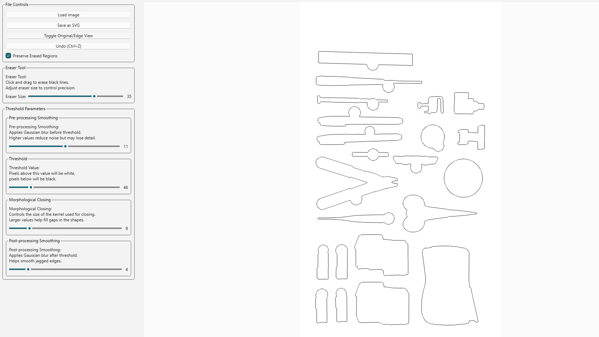

## Current Settings

- **Program:** `svg_edges_2`
- **Status:** Working okay, kind of hacky (you need to erase bad areas.)

## websites to consider for future use:
##### https://learnopencv.com/filling-holes-in-an-image-using-opencv-python-c/
##### https://stackoverflow.com/questions/47777585/detecting-outer-most-edge-of-image-and-plotting-based-on-it